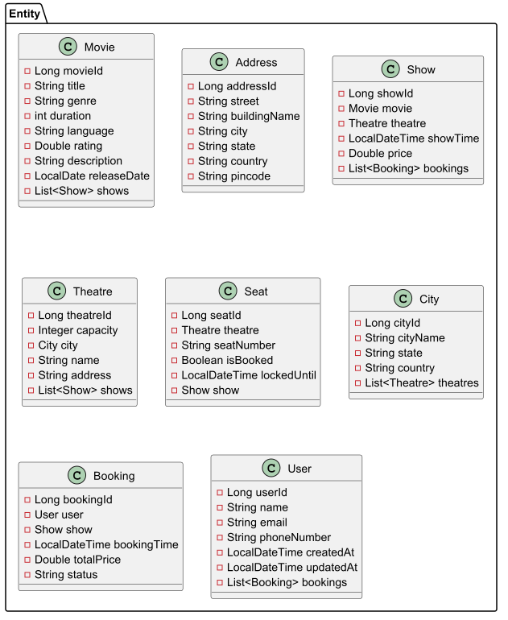

**Project Overview**

CineReserve is a ticket booking system that simulates real-world movie booking applications.

Users can:
    Browse movies by city or theatre.
    View movie show timings.
    Select and book seats in real-time.
    Make payments for tickets.
    It also supports high concurrency seat booking with pessimistic locking to prevent race conditions. Theatre admins can manage shows and view booking reports.

